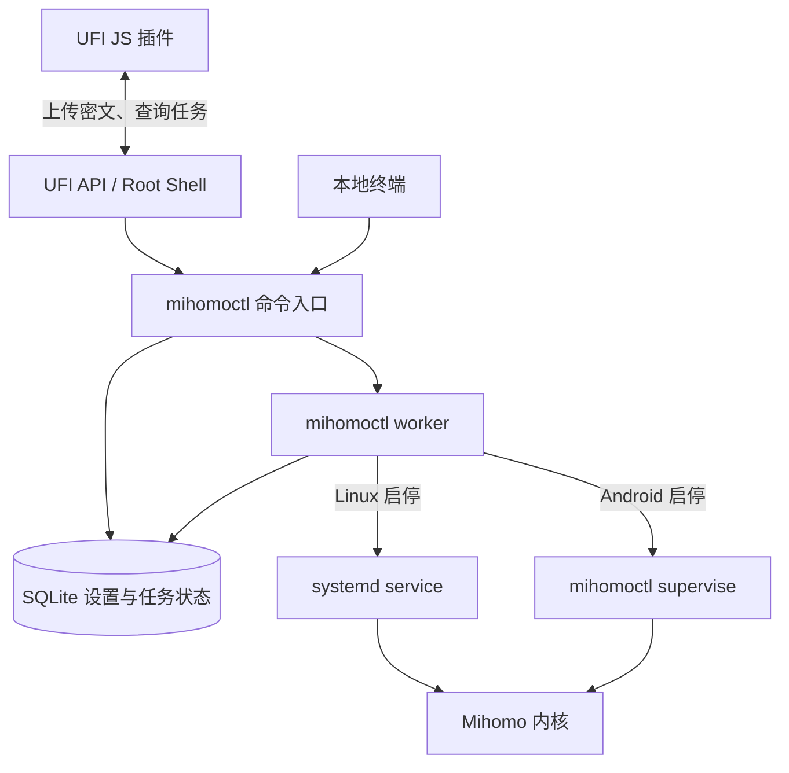

# mihomoctl

独立的 Mihomo 管理器。UFI / Android 与 Linux 共用 CLI、内核下载更新、订阅、配置校验与回滚、任务和日志；二进制由 mihomoctl 自行管理，无需通过包管理器安装 Mihomo。

- **UFI-TOOLS / Android**：提供插件界面，管理守护、自启及热点 / USB 共享。F50 是适用设备之一，不代表所有 UFI 硬件均已验证。
- **Linux**：CLI 自动安装和清理 systemd service、设置自启；网络规则由用户配置，详见 [Linux 使用说明](docs/linux.md)。

[发行版](https://github.com/imbytecat/mihomoctl/releases) · [反馈](https://github.com/imbytecat/mihomoctl/issues)

## 工作方式

mihomoctl 是有持久状态的本机管理器。它管理内核下载更新、订阅、配置校验与回滚、启停和自启；**代理流量始终由 Mihomo 处理**。设备上没有独立的 mihomoctl Web API 服务。



- **UFI 插件负责交互**：首次安装引导下载并校验 mihomoctl。订阅和设置等请求先用设备公钥加密，再通过 UFI 上传；Root Shell 只把上传引用和摘要交给 ctl。ctl 解密并校验请求，插件通过任务 ID 查询进度。订阅和密钥明文不会进入公开上传文件或 Root Shell 命令。
- **ctl 负责完整操作**：本地 CLI 与 UFI 请求进入同一个 Manager。任务接收后写入 SQLite，并启动独立的 `mihomoctl worker`，由它完成下载、校验、配置切换、重启验证与失败回滚。终端或页面关闭不会取消已接收任务；重新连接后查询原任务。worker 执行结束便退出，进程意外中断会标记任务中断，不会自动重放请求。
- **平台负责持续运行**：Linux 的 systemd service 直接运行 Mihomo，短期 worker 通过 systemd scope 托管；Android 上的 `mihomoctl supervise` 持续守护 Mihomo 并同步共享网络规则。自启分别交给 systemd 和 UFI 自启机制。CLI 命令退出后，内核仍能继续运行。

发行查询与组件下载默认直连 GitHub；可配置自建转发服务。订阅由设备访问用户提供的地址。

UFI 守护没有固定运行时限。内核异常退出或网络保护准备暂时失败时会延迟重试，最长间隔 30 秒；无法确认监听保护时会先终止本次内核。运行日志会区分停止请求、内核退出和网络错误。进程已退出但仍有自有网络规则时，页面显示「待清理」，可点击「清理残留规则」。

## UFI 安装

需要 UFI-TOOLS 完整版、root / 高级功能，以及支持 TPROXY 的系统。启动前会在未挂接流量的自有链中检查实际规则能力，并固定本安装使用的 IPv4/IPv6 防火墙后端；「更多操作 → 网络诊断」可查看后端、程序路径和版本。插件界面使用 Chrome / Android System WebView 153 或以上版本。

1. 已安装其他代理插件时，先在原界面卸载并关闭自启，再移除原插件。
2. 下载 `mihomoctl-ufi.js`，在 UFI 插件管理导入、保存并刷新。
3. 安装 mihomoctl / 服务和内核，粘贴完整 YAML 订阅，点击「保存并更新」。
4. 启动代理，确认客户端能正常上网后再开启自启；安装 Zashboard 后点击「打开面板」，会携带当前地址、端口和密钥在新标签页自动连接并进入代理页。

GitHub 连接不佳时，可自行部署 [netnr/workers 的 cors.js](https://github.com/netnr/workers)，在「设置 → 安装与更新 → 发行转发地址」填写 HTTPS 域名，例如 `https://mirror.example.com`，不附路径、参数或口令。首次安装直接使用所填地址并保存到设备；安装后修改需点击「保存转发设置」，留空恢复直连。初装、三组件版本检查与下载共用设置，订阅和 UFI 通信不经过转发。请使用自己部署或信任的服务；同一服务提供的文件与摘要不是独立来源证明。

普通补丁更新无需卸载：替换插件后，在「设置 → 安装与更新」更新 mihomoctl（运行中先停止代理），保留订阅与设置。当前协议为 9、数据库 schema 为 7，与 v0.15.0 相同；仅不兼容的协议或存储变更需要重装，不提供旧状态迁移。确需重装时，可点击首页「卸载现有安装」；插件会调用设备上的 ctl 停止服务并清理，确认安装目录和引导目录消失后即可重新安装。卸载入口不依赖运行状态解析，失败会显示具体原因，不直接强删目录。

## 本地 YAML 覆写

「设置 → 本地覆写」直接编辑 Mihomo YAML。普通参数不设白名单，配置是否可用由所安装的内核检查；映射递归合并，数组整体替换。订阅原文保留，覆写、最终配置和元数据随同一版本应用及回滚。

```yaml
external-controller: ":9191"
log-level: info
dns:
  enhanced-mode: fake-ip
```

新安装生成默认控制地址和随机密钥；清空并保存会回到基础管理设置，保留当前控制端口和密钥。可用「生成新密钥」写入 `secret`，保存后生效。TPROXY、DNS 监听、平台绑定和监听保护由管理器维护，不能通过覆写使其失配。覆写含密钥时仍加密上传、加密读取，并以私有 YAML 保存。

## Linux 安装

需要 root、systemd。下载对应架构的 `mihomoctl-linux-amd64`、`mihomoctl-linux-arm64` 或 `mihomoctl-linux-armv7` 及 `SHA256SUMS`。以 AMD64 为例：

```sh
sha256sum --check --ignore-missing SHA256SUMS
chmod +x mihomoctl-linux-amd64
sudo ./mihomoctl-linux-amd64 install
```

安装自动复制 mihomoctl 到 `/var/lib/mihomoctl/mihomoctl` 并注册 service；接下来通过 CLI 下载内核、保存订阅并启动。后续使用安装目录内的 mihomoctl，确保自更新生效，首次下载的安装文件可删除。同名 service 冲突时会拒绝覆盖，可用 `install --unit 自定义名称.service`。

## 两平台通用 CLI

在设备本地 **root 终端**执行，Linux 可先运行 `sudo -i`。Linux 使用以下路径；UFI 改为 `ctl=/data/mihomoctl/mihomoctl`：

```sh
ctl=/var/lib/mihomoctl/mihomoctl
"$ctl" download
```

创建权限为 `0600` 的本地 `request.json`，填入完整 YAML 订阅链接。秘密通过文件或 `--input -` 的标准输入传递，勿粘贴到 UFI 会记录内容的 Root Shell 窗口。

```json
{"url":"https://example.com/your-subscription"}
```

```sh
"$ctl" update --input request.json
"$ctl" start
"$ctl" boot-on
"$ctl" status
```

| 操作 | 命令（接在 `"$ctl"` 后） |
| --- | --- |
| 停止 / 重启 | `stop` / `restart` |
| 更新已保存的订阅 | `update` |
| 更新内核 / mihomoctl（先停止代理） | `download` / `self-update` |
| 关闭自启 | `boot-off` |
| 安装或更新 Zashboard | `download-dashboard` |
| 检查 mihomoctl / 内核 / 面板更新 | `check-updates` |
| 保存发行转发地址 | `save-release-proxy --input 文件`，JSON：`{"releaseProxy":"https://mirror.example.com"}`；空字符串恢复直连 |
| 查看日志 / 网络诊断 | `logs` / `diagnose` |
| 卸载 mihomoctl、内核及全部数据 | `uninstall` |

插件「安装与更新」中点击「检查更新」，查看各组件当前版本、最新版本及检查时间；不会自动升级。检查结果保存在设备 SQLite，刷新页面或执行 `status` 读取上次结果，手动检查才联网；安装或更新后会将实际版本与缓存的最新版本重新比较，不重复联网，也不修改上次检查时间。

下载任务在首页显示已下载大小、总大小、速度与百分比；总大小未知时显示已接收字节，不虚构百分比。长时间无新数据会提示停滞并超时报错。初装、内核／面板／Agent 下载和订阅下载可点击「取消任务」；取消会通知设备停止下载并清理临时文件，页面刷新后仍能查看和取消原任务。进入文件替换或配置应用阶段后不再接受取消。

插件通过「概览 / 设置 / 日志」切换页面，运行状态、任务进度与取消入口始终可见，切换不会清空草稿。启动或重启时自动打开日志页，任务执行中即可查看内核输出。

日志分为「Mihomo」「管理器」「任务 / 详情」：代理流量独立展示；管理器累计守护、任务和插件操作记录。使用 React Virtuoso 虚拟列表，支持搜索、ANSI 颜色、错误高亮和下载。UFI 每约 2 秒按游标读取新增内容，不是服务端推流；上翻仅停止滚动跟随，切换功能标签仍继续收集。每类在当前页面保留最近最多 5000 行，并限制文本大小；刷新页面后重新读取设备最近日志；日志轮换或积压超过单次读取上限时会标明省略。暂停收集、收起插件或浏览器进入后台会暂停读取；「清空显示」不删除设备文件。使用此功能需要同步更新插件和 Agent。

操作失败时显示具体原因及清理结果；明确的监听端口冲突会提前结束启动并清理。任务详情显示开始、结束与耗时；worker 日志包含时间、级别和任务 ID，并累计到设备上的 `runtime/tasks.log`。CLI 可用 `cancel ID` 请求取消并等待清理，`--no-wait` 只等待取消请求被接收；取消任务不会停止已运行的 Mihomo。

操作默认等待完成；自动化需要立即返回时加 `--no-wait`，用 `job ID`、`job-log ID` 查询。终端或页面关闭不会取消已接收任务；重新连接后用 `status` 查看最近任务，不要重复提交。

`request.json` 仅用于传入本次参数，保存成功后可删除；后续 `update` 使用设备已保存的订阅链接。

## 数据与安全

设置、任务和配置版本元数据保存在私有 SQLite；YAML、日志和二进制单独存放。**卸载会停止代理、关闭自启并删除本安装的全部数据，不留备份，不可恢复。** Linux 同时移除本安装的 service；删除 UFI 插件本身不会停止代理。

只在可信网络使用管理入口。UFI 接管 IPv4 共享流量，故障或停止期间可能直连，不提供断网保护。Linux 默认监听回环地址；私网地址绑定不等于防火墙隔离，转发、TPROXY、DNS 接管及故障策略仍需由用户配置。mihomoctl 不修改 Linux 防火墙和路由。

当前提供 UFI 插件和本地 CLI，没有独立 Web 服务。自动化测试不等于 F50 实机或真实代理流量验收。

## 从源码构建

根目录是 Go 模块；`ui/` 是可选的 UFI 前端。mise 统一固定 Go、Bun 和开发工具版本；Bun 同时负责包管理和前端工具运行，设备上的 mihomoctl 和 Mihomo 均为独立 Go 二进制。

自用 [UFI TypeScript SDK](ui/packages/ufi-sdk/README.md) 作为 `ui/` 的 workspace 包维护，封装设备接口与签名；前端只按需导入 Shell 和上传等能力。

安装 [mise](https://mise.jdx.dev/) 后：

```sh
mise install
mise exec -- just build        # .build/mihomoctl，无需前端依赖
mise exec -- just ui           # ui/dist/mihomoctl-ufi.js
mise exec -- just check        # Go、前端、Shell 和 CI 检查
mise exec -- just browser-install
mise exec -- just test-ui      # 真实浏览器回归
```

运行 `mise exec -- just` 查看全部命令；启用 mise shell 集成后可直接使用 `just`。GoReleaser 负责三架构构建、校验和发布：`just snapshot` 本地预览，`just release` 从当前 Git 标签构建且不上传；推送 `v*` 标签触发发布 CI，已有资产不会覆盖。

前端使用 Vite + Tailwind 4，Bun 负责包管理和运行时。测试统一使用 Vitest：`node` 测试项目在 Bun 上验证源码与 Go CLI 集成；Browser Mode 使用 Playwright 驱动真实 Chromium，在同源 iframe 中验证生产插件加载、交互与刷新重连。失败截图和 trace 位于 `ui/test-results/`。

源码测试可用 `cd ui && bun run test:watch` 持续运行；完整验证仍使用上面的 `just check` 和 `just test-ui`。

SQLite 查询由 sqlc 生成，仍使用 `database/sql` + 纯 Go `modernc SQLite`。修改 SQL 后运行 `just generate` 并提交生成文件；`just check` 检查生成代码是否同步，正常 Go 构建无需 sqlc。
